# REV|NIL — Master Business & Technical Plan

## The Unified Platform for Post-House Collegiate Athletics Management

---

## Table of Contents

1. [Executive Summary](#1-executive-summary)
2. [Market Analysis: Gaps & Opportunities](#2-market-analysis-gaps--opportunities)
3. [Business Venture Definition](#3-business-venture-definition)
4. [Stakeholder Needs Map](#4-stakeholder-needs-map)
5. [Platform Architecture Overview](#5-platform-architecture-overview)
6. [Product Design: Modules & Interconnections](#6-product-design-modules--interconnections)
7. [Regulatory Compliance Framework](#7-regulatory-compliance-framework)
8. [Technical Architecture — Google Cloud Platform](#8-technical-architecture--google-cloud-platform)
9. [AI Strategy: Hybrid Approach](#9-ai-strategy-hybrid-approach)
10. [Development Methodology: AI-Assisted Vibe Coding](#10-development-methodology-ai-assisted-vibe-coding)
11. [Phased Implementation Roadmap](#11-phased-implementation-roadmap)
12. [Revenue Model & Investment Readiness](#12-revenue-model--investment-readiness)
13. [Risk Analysis](#13-risk-analysis)
14. [Competitive Landscape](#14-competitive-landscape)
15. [Critical Architectural Decisions & Tradeoffs](#15-critical-architectural-decisions--tradeoffs)

---

## 1. Executive Summary

**REV|NIL** is an ERP-class, multi-tenant platform that unifies the two-bucket compensation system created by the *House v. NCAA* settlement — institutional revenue sharing and third-party NIL deals — into a single, intelligent operating system for collegiate athletics.

### The Core Thesis

The *House* settlement created a **two-system problem**: universities manage revenue sharing through CAPS, while third-party NIL flows through NIL Go. These systems do not talk to each other, yet athletic departments are legally liable for understanding the *total compensation picture* of every athlete. No platform currently bridges this gap with purpose-built management tools for all stakeholders.

**REV|NIL fills this gap** by integrating with both mandated systems via API and providing:

- **For Athletic Departments:** A "General Manager" command center that unifies cap management, roster valuation, Title IX modeling, and total compensation visibility
- **For NIL Collectives/Entities:** An operations platform for deal management, proof of activation, VBP compliance, and donor-to-brand conversion
- **For Athletes/Agents:** A personal finance and deal management app with tax optimization, contract intelligence, and automated NIL Go submission

### Founding Advantages

| Advantage | Detail |
|:----------|:-------|
| **Domain Expertise** | Co-founder is Associate Athletic Director at the University of Oklahoma — a Power 4 institution operating at the epicenter of these changes |
| **Insider Access** | Direct access to real workflows, pain points, and decision-makers at a top-tier program |
| **Technical Leverage** | AI-assisted development enables a solo technical founder to build enterprise-grade software |
| **First-Mover Timing** | The *House* settlement took effect mid-2025; the market is in acute pain NOW with no dominant platform |
| **Google Ecosystem** | Full GCP/Firebase stack provides rapid development, scalability, and enterprise credibility |

---

## 2. Market Analysis: Gaps & Opportunities

### 2.1 Identified Gaps from Research

```mermaid
graph TD
    A[The Two-Bucket Problem] --> B[Gap 1: No Unified Total Compensation View]
    A --> C[Gap 2: CAPS and NIL Go Are Siloed]
    A --> D[Gap 3: No Real-Time Title IX Modeling]
    
    E[Operational Gaps] --> F[Gap 4: GMs Use Spreadsheets for Roster Valuation]
    E --> G[Gap 5: Collectives Cannot Prove VBP Easily]
    E --> H[Gap 6: Athletes Lack Tax Planning Tools]
    
    I[Intelligence Gaps] --> J[Gap 7: High Information Asymmetry in Player Market]
    I --> K[Gap 8: No Predictive Transfer Portal Analytics]
    I --> L[Gap 9: No Cross-Stakeholder Communication Platform]
    
    M[Compliance Gaps] --> N[Gap 10: Institutional Knowledge Liability Has No Tooling]
    M --> O[Gap 11: Manual NIL Go Submission Is Error-Prone]
    M --> P[Gap 12: Deal Rejection Rates Are High Due to Poor Preparation]
```

### 2.2 Gap Detail Matrix

| # | Gap | Current Workaround | Severity | REV|NIL Solution |
|:--|:----|:-------------------|:---------|:-----------------|
| 1 | No unified view of Rev Share + NIL per athlete | Manual cross-referencing of CAPS and NIL Go | **Critical** | Total Compensation Dashboard |
| 2 | CAPS and NIL Go are completely siloed systems | Spreadsheets, emails, phone calls | **Critical** | API integration hub bridging both systems |
| 3 | No real-time Title IX impact modeling | Retrospective audits, legal counsel | **Critical** | Live Title IX scenario simulator |
| 4 | Roster valuation done by intuition/spreadsheets | Excel models, agent conversations | **High** | AI-powered Roster Valuation Engine |
| 5 | Collectives cannot easily prove VBP to CSC | Manual documentation, photo evidence | **High** | Automated Proof of Activation system |
| 6 | Athletes face tax bracket trap with hybrid status | CPA referrals, post-hoc tax surprises | **High** | Real-time hybrid tax engine |
| 7 | Player market pricing is opaque | Fragmented agent intel, rumors | **High** | Market intelligence from aggregated data |
| 8 | No predictive analytics for transfer portal | Coach intuition, 247Sports | **Medium** | Predictive retention/portal modeling |
| 9 | No structured communication between AD/Collective/Athlete | Text messages, phone calls, informal channels | **High** | Secure cross-stakeholder messaging |
| 10 | Institutional knowledge liability has no tooling | Compliance officers manually monitoring | **Critical** | Risk Dashboard with automated flagging |
| 11 | NIL Go submission is manual and tedious | Agents manually entering deal data | **Medium** | AI-powered deal submission bot |
| 12 | High deal rejection rate due to poor contract language | Trial and error | **Medium** | VBP Pre-Check AI analyzer |

### 2.3 Market Sizing

| Segment | Count | Est. Annual Contract Value | TAM |
|:--------|:------|:---------------------------|:----|
| Division I Athletic Departments | ~350 | $50,000 - $200,000/yr | $17.5M - $70M |
| NIL Collectives/Entities | ~500+ | $12,000 - $60,000/yr | $6M - $30M |
| Agents | ~2,000+ | $2,400 - $12,000/yr | $4.8M - $24M |
| Athletes - Premium | ~5,000 | $600 - $1,200/yr | $3M - $6M |
| Athletes - Free/Basic | ~150,000+ | $0 - freemium | Network effect driver |
| **Total Addressable Market** | | | **$31M - $130M ARR** |

### 2.4 Opportunity: The Network Effect Moat

The critical insight is that **value compounds across stakeholders**. Each stakeholder added to the platform increases value for all others:

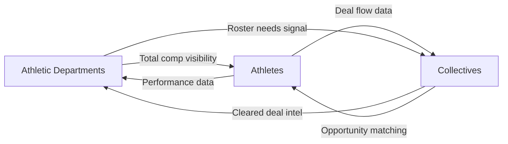

Once an Athletic Department is on the platform, their athletes and associated collectives are pulled in. Once collectives are managing deals through the platform, their athlete rosters join. **This is the flywheel.**

---

## 3. Business Venture Definition

### 3.1 Company: REVNIL, Inc.

**Mission:** To provide the unified operating system that makes the post-House collegiate athletics economy work — for institutions, for collectives, and for athletes.

**Vision:** Become the indispensable infrastructure layer of collegiate athletics management, analogous to what Salesforce is to CRM or what Workday is to HR.

### 3.2 Brand Architecture

```
REV|NIL - Parent Brand / Platform
├── REV|NIL GM         — Athletic Department General Manager Platform
├── REV|NIL Collective — NIL Entity / Collective Operations Platform  
├── REV|NIL Athlete    — Athlete Personal Finance and Deal Management App
└── REV|NIL Connect    — Cross-Stakeholder Communication and Data Hub
```

### 3.3 Competitive Positioning

| Competitor | What They Do | What They Lack |
|:-----------|:-------------|:---------------|
| **Teamworks/INFLCR** | Athlete brand management, content distribution | No cap management, no Title IX modeling, not a financial instrument |
| **Opendorse** | NIL marketplace, deal facilitation | No rev share integration, no GM tools |
| **Basepath** | Emerging GM tool | Limited scope, no collective/athlete apps, no ecosystem play |
| **CAPS - LBi** | Mandated cap ledger | Compliance-only; no strategy, no intelligence, no stakeholder ecosystem |
| **NIL Go - Deloitte** | Mandated deal clearinghouse | Clearance-only; no management tools, no pre-submission intelligence |

**REV|NIL differentiator:** We are the **only platform that bridges the two-bucket system** and serves all three stakeholder groups in an integrated ecosystem. We do not compete with CAPS or NIL Go — we make them dramatically more useful by building the intelligence and management layer on top.

---

## 4. Stakeholder Needs Map

### 4.1 Athletic Department Personas & Needs

| Persona | Key Pain Points | REV|NIL Solution |
|:--------|:----------------|:-----------------|
| **General Manager** | Allocating $20.5M cap efficiently; valuing players; competing for talent | Roster Valuation Engine, Cap Simulator, Market Intelligence |
| **Athletic Director** | Strategic oversight; Title IX liability; board reporting | Executive Dashboard, Title IX Monitor, Compliance Scorecards |
| **CFO / Finance** | Payroll complexity; employer tax burden; budget modeling | Hybrid Payroll View, Tax Calculator, Budget Forecasting |
| **Compliance Officer** | Institutional knowledge liability; monitoring third-party deals | Risk Dashboard, NIL Go Shadow Ledger, Alert System |
| **Head Coaches** | Recruiting leverage; retention intelligence; roster planning | Recruiting Intel Feed, Retention Risk Alerts, Roster Planner |

### 4.2 NIL Collective Personas & Needs

| Persona | Key Pain Points | REV|NIL Solution |
|:--------|:----------------|:-----------------|
| **Collective Executive** | Surviving VBP requirements; pivoting from donor model to agency model | Deal Pipeline Manager, VBP Compliance Engine |
| **Account Manager** | Tracking deliverables; proving activation; managing multiple athletes | Proof of Activation Tracker, Deliverable Calendar |
| **Donor Relations** | Converting donors to business partners | CRM with Donor-to-Brand Matching |
| **Finance** | Payment tracking; 1099 issuance; CSC audit readiness | Financial Ledger, Audit-Ready Report Generation |

### 4.3 Athlete & Agent Personas & Needs

| Persona | Key Pain Points | REV|NIL Solution |
|:--------|:----------------|:-----------------|
| **Student-Athlete** | Tax confusion; deal management; understanding total compensation | Hybrid Tax Dashboard, Deal Tracker, Net Income Calculator |
| **Agent** | Manual NIL Go submission; deal rejection risk; client portfolio management | Deal Submission Bot, VBP Pre-Check, Client Portfolio Dashboard |
| **Parent** | Visibility into child financial situation; protecting from bad deals | Family View Dashboard, Deal Alert Notifications |

---

## 5. Platform Architecture Overview

### 5.1 Multi-Tenant ERP Architecture

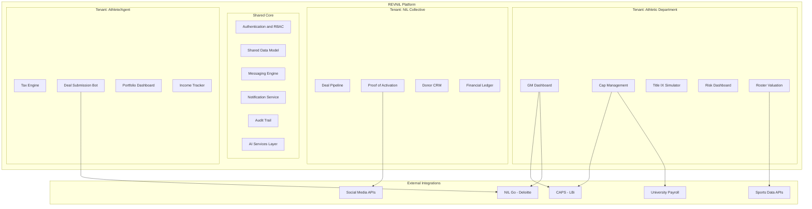

### 5.2 Multi-Tenancy Model

REVNIL uses a **logical multi-tenancy** model where each tenant type has its own views, permissions, and workflows, but shares the underlying data infrastructure. This enables the critical **cross-stakeholder data flows** that create the platform network effect.

**Tenant Isolation Rules:**
- Each Athletic Department sees ONLY their own athletes and financial data
- Each Collective sees ONLY their contracted athletes and deal pipeline
- Each Athlete sees ONLY their own compensation and deal data
- **Cross-tenant data sharing** occurs ONLY through explicit consent and defined data contracts

**Data Sharing Consent Model:**
```
Athlete CONSENTS to share deal data with → Their University Compliance Office
University PUBLISHES roster needs to → Verified Collectives in their ecosystem  
Collective REPORTS deal status to → University Compliance + Athlete
```

---

## 6. Product Design: Modules & Interconnections

### 6.1 REVNIL GM — Athletic Department Platform

#### Module 1: Total Compensation Command Center

The flagship feature. A single dashboard showing every athlete's **combined** compensation:

| Data Source | System | Integration Method |
|:------------|:-------|:-------------------|
| Revenue Share Payments | CAPS | CSV import initially; API when available |
| Alston Awards | CAPS | CSV import initially; API when available |
| Scholarship Value | University SIS | Manual data entry or CSV import |
| Third-Party NIL Deals - Cleared | NIL Go | CSV import initially; API when available |
| Third-Party NIL Deals - Pending | NIL Go | CSV import initially; API when available |
| Collective Deal Commitments | REV|NIL Collective | Internal data flow |

**Key Views:**
- Per-athlete total compensation breakdown
- Per-sport aggregate spending vs. Title IX thresholds
- Cap utilization gauge with remaining allocation
- Comparison: planned allocation vs. actual spending

#### Module 2: Cap Management & Scenario Simulator

Builds on top of CAPS data with strategic planning tools CAPS does not offer:

- **Drag-and-drop roster builder** with real-time cap impact
- **What-if scenarios:** "If we sign Transfer QB at $1.2M, show me the cap impact and Title IX delta"
- **Employer burden calculator:** True cost = Rev Share + FICA + Workers Comp + Benefits
- **Multi-year projections:** Year 1 cap at $20.5M, projected Year 2 at $22M — model commitments forward

#### Module 3: Title IX Real-Time Monitor

- Live proportionality tracking: % of cap spent on mens vs. womens sports
- Safe harbor threshold alerts
- Scenario impact: every proposed roster change shows Title IX delta BEFORE commitment
- Compliance report generation for legal counsel

#### Module 4: Risk & Institutional Knowledge Dashboard

Addresses the **"affirmative duty to report"** requirement:

- Shadow ledger of all third-party NIL activity the university has visibility into
- Risk scoring per athlete: combines deal volume, payor risk, ROC outlier flags
- Automated alerts: "Athlete X has a pending deal from a flagged Associated Entity"
- Audit trail: documents what the university "knew and when" for legal protection

#### Module 5: Roster Valuation Engine - AI-Powered (Phase 3+)

- Player valuation model: WinShare x UnitValue + BrandValue x MediaMultiplier
- Transfer portal market intelligence from aggregated, anonymized platform data
- "Wins Per Dollar" efficiency metric
- Retention risk scoring: likelihood of player entering portal based on playing time, team performance, coaching changes

### 6.2 REV|NIL Collective — Entity Operations Platform

#### Module 1: Deal Pipeline Manager

- Full lifecycle management: prospect > negotiate > contract > activate > complete > report
- VBP compliance checklist built into every deal template
- Contract template library with CSC-compliant language
- Integration with NIL Go for submission status tracking

#### Module 2: Proof of Activation System

- Mobile check-in for athlete appearances with geo-verification
- Social media monitoring: verify sponsored posts are live and compliant
- Deliverable tracking calendar with automated reminders
- One-click "Compliance Packet" generation formatted for NIL Go audits

#### Module 3: Donor-to-Brand CRM

- Donor database with business classification
- AI matching: donor businesses to athlete demographics and follower geography
- Deal proposal generator: "Donor X car dealership + Athlete Y = suggested $5k/month, 2 posts"
- Conversion tracking: donor contributions vs. legitimate business deal value

#### Module 4: Financial Operations

- Payment scheduling and tracking
- 1099 generation and distribution
- Revenue and expense reporting
- CSC audit-ready financial reports

### 6.3 REV|NIL Athlete — Personal App

#### Module 1: Total Income Dashboard

- Unified view: W-2 revenue share + 1099 NIL income
- Real-time net income after taxes
- Income by source visualization
- Year-over-year earnings tracking

#### Module 2: Hybrid Tax Engine

- Calculates marginal tax rate on combined W-2 + 1099 income
- Quarterly estimated tax payment reminders and calculations
- "Tax Reserve" recommendation: % of every 1099 payment to set aside
- Integration with tax preparation services

#### Module 3: Deal Management

- All active, pending, and completed NIL deals in one place
- Contract status tracking with NIL Go submission status
- Deliverable calendar: what is owed, when, to whom
- Payment tracking: expected vs. received

#### Module 4: AI Deal Assistant

- Contract upload via photo or PDF
- AI extraction of key terms: counterparty, amount, deliverables, duration
- VBP Pre-Check: "This contract has a 90% chance of CSC approval" or "Warning: lacks specific deliverables"
- Suggested contract improvements before NIL Go submission

### 6.4 REV|NIL Connect — Cross-Stakeholder Hub

The connective tissue that makes REV|NIL an ecosystem, not just three separate apps:

- **Secure messaging** between verified stakeholders with full audit trail
- **Deal coordination:** Collective proposes deal > Athlete reviews > University compliance is notified
- **Document sharing:** Contracts, compliance packets, tax documents shared through controlled channels
- **Notification hub:** Consolidated alerts across all modules

### 6.5 Module Interconnection Map

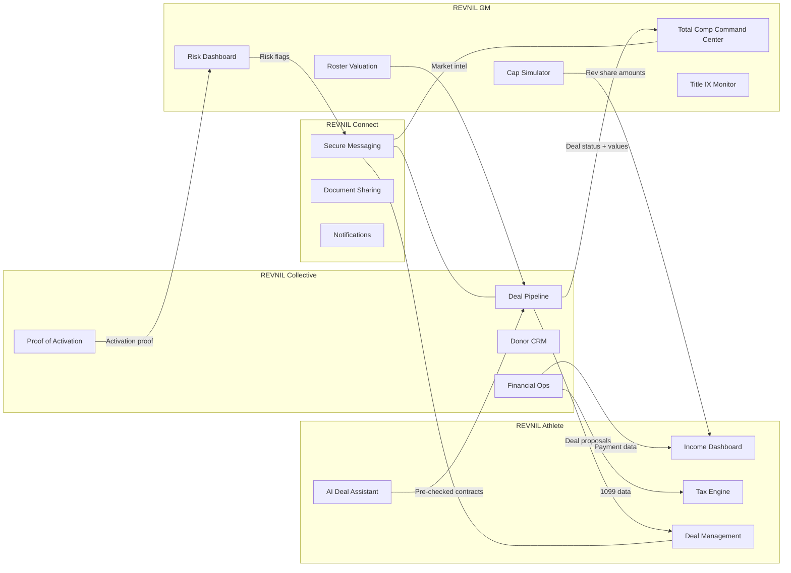

---

## 7. Regulatory Compliance Framework

### 7.1 Design Principle: Compliance as Infrastructure

REV|NIL does not merely support compliance — **compliance is the architectural foundation**. Every feature is built with regulatory guardrails as first-class citizens.

### 7.2 Regulatory Integration Strategy

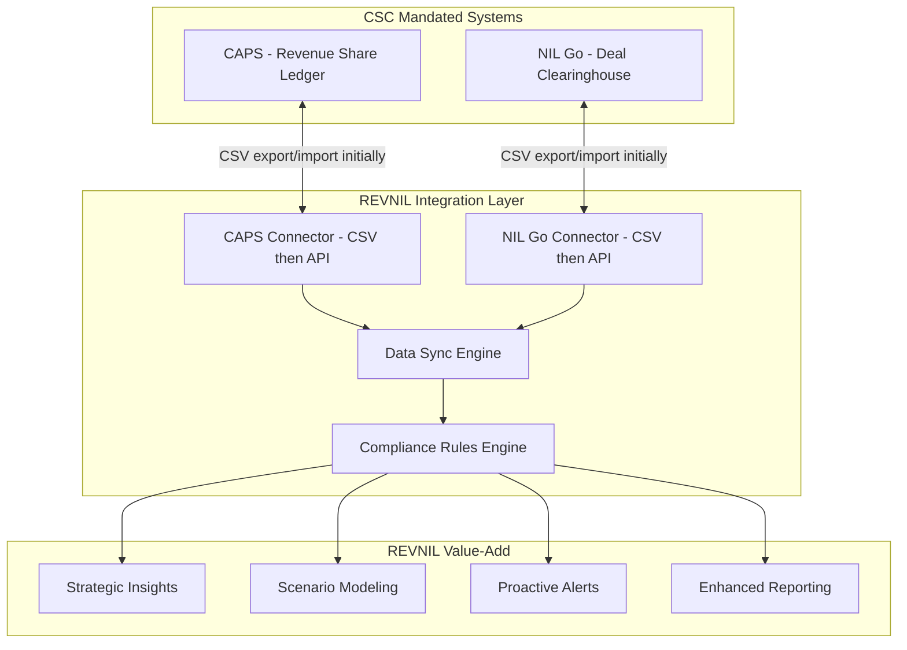

### 7.3 Key Compliance Guardrails

| Regulatory Requirement | REV|NIL Guardrail |
|:-----------------------|:------------------|
| $20.5M Revenue Share Cap | Real-time cap tracker with hard-stop alerts at 95%, 98%, 100% |
| $600 Aggregate Reporting Threshold | Automated tracking of cumulative deal value per payor per athlete |
| Valid Business Purpose requirement | VBP checklist enforced in every deal template; AI pre-check before submission |
| Range of Compensation / FMV | Algorithmic benchmarking against platform deal database |
| Associated Entity heightened scrutiny | Payor classification system with booster/associated entity flagging |
| Title IX equitable distribution | Real-time proportionality dashboard with scenario modeling |
| Institutional knowledge / affirmative duty | Automated risk flagging + documented audit trail of what was known when |
| Roster limit compliance | Headcount tracking integrated with cap management |
| 14-day arbitration filing window | Calendar alerts for rejected deals with countdown timer |

### 7.4 Data Privacy & Compliance

| Requirement | Implementation |
|:------------|:---------------|
| FERPA - Student Records | Athlete academic data never stored; only financial/athletic data with consent |
| State NIL Laws - Varies by state | Configurable rules engine per institution state jurisdiction |
| Tax Reporting - W-2/1099 | Platform facilitates visibility; does not act as tax advisor - clear disclaimers |
| Employment Law | Platform documents the employment relationship; does not create it |
| Antitrust | Platform aggregates data only in anonymized/benchmarking form; no price-fixing facilitation |

### 7.5 Critical Legal Boundaries

**REV|NIL DOES:**
- Provide tools for management and visibility
- Integrate with mandated systems as authorized
- Generate reports and analytics
- Facilitate communication between consenting parties
- Provide AI-assisted analysis and recommendations

**REV|NIL DOES NOT:**
- Act as a financial advisor, tax advisor, or legal counsel
- Make payments directly (facilitates tracking of payments made through proper channels)
- Replace CAPS or NIL Go (builds on top of them)
- Share data between tenants without explicit consent
- Determine or dictate compensation amounts

---

## 8. Technical Architecture — Google Cloud Platform

### 8.1 Technology Stack

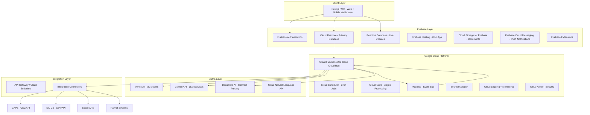

### 8.2 Detailed Stack Specification

| Layer | Technology | Purpose |
|:------|:-----------|:--------|
| **Frontend** | Next.js 14+ with React, deployed as PWA on Firebase Hosting | Single codebase for web AND mobile; installable on phones; offline-capable |
| **Authentication** | Firebase Authentication with Google Identity Platform | Multi-provider auth: Google, email/password, SSO for universities |
| **Primary Database** | Cloud Firestore | NoSQL document database; multi-tenant data model; real-time sync; offline support |
| **Real-time Updates** | Firebase Realtime Database | Live dashboards, notifications, real-time collaboration features |
| **File Storage** | Cloud Storage for Firebase | Contract PDFs, compliance packets, media assets |
| **Backend Logic** | Cloud Functions 2nd Gen + Cloud Run | Serverless compute for API endpoints, business logic, background processing |
| **Event Bus** | Pub/Sub | Decoupled event-driven architecture for cross-module communication |
| **Task Queue** | Cloud Tasks | Reliable async processing: report generation, data sync, batch operations |
| **Scheduled Jobs** | Cloud Scheduler | Periodic data sync, report generation, tax calculations |
| **AI - LLM** | Gemini API via Vertex AI | Contract analysis, VBP pre-check, deal recommendations, natural language queries |
| **AI - Document Processing** | Document AI | Contract PDF parsing, data extraction, OCR for photographed contracts |
| **AI - ML Models** | Vertex AI AutoML + Custom Training | Roster valuation, retention prediction, deal FMV benchmarking |
| **AI - NLP** | Cloud Natural Language API | Sentiment analysis on contracts, keyword extraction for VBP screening |
| **API Management** | API Gateway / Cloud Endpoints | External API exposure, rate limiting, authentication for integrations |
| **Security** | Cloud Armor, VPC Service Controls, IAM | WAF, DDoS protection, fine-grained access control |
| **Monitoring** | Cloud Logging, Cloud Monitoring, Error Reporting | Full observability stack |
| **Secrets** | Secret Manager | API keys, integration credentials, encryption keys |
| **CI/CD** | Cloud Build + GitHub Actions | Automated testing, deployment pipelines |
| **Analytics DB (Phase 4)** | BigQuery | Complex aggregation queries, benchmarking analytics, investor reporting |

### 8.3 Firestore Multi-Tenant Data Model

```
/institutions/{institutionId}/
    profile: name, conference, state, tier, ...
    config: capsImportFormat, nilGoImportFormat, fiscalYearStart, ...
    roster/{athleteId}/
        revShare: amount, status, payPeriod, ...
        totalComp: revShare, nilCleared, nilPending, scholarships, alston
        titleIXCategory: sport, gender
        valuation: winShare, brandValue, projectedValue
    capManagement/
        currentYear: total, allocated, remaining, projections
        scenarios/{scenarioId}: name, changes, impact
    titleIX/
        current: mensTotal, womensTotal, ratio, safeHarbor
    riskAlerts/{alertId}/
        athleteId, type, severity, details, acknowledged
    imports/{importId}/
        source, type, timestamp, recordCount, status, errors

/collectives/{collectiveId}/
    profile: name, type, associatedInstitutions, ...
    deals/{dealId}/
        athleteId, counterparty, value, deliverables, status, nilGoStatus, vbpScore
    activations/{activationId}/
        dealId, type, proof, geoData, socialVerification
    donors/{donorId}/
        business, category, conversionStatus, matchedAthletes
    financials/
        payments/{paymentId}: dealId, amount, date, type
        reports/{reportId}: period, totals, auditReady

/athletes/{athleteId}/
    profile: name, sport, institution, agent, socialMedia, ...
    income/
        w2/{recordId}: source, grossAmount, withholdings, period
        nil1099/{recordId}: source, amount, date, dealId
        taxProjection: combinedIncome, marginalRate, estimatedTax, reserveTarget
    deals/{dealId}/
        collectiveId, counterparty, value, deliverables, nilGoStatus, vbpPreCheck
    consent/
        institutionSharing, collectiveSharing, dataPreferences

/connect/
    conversations/{conversationId}/
        participants, type, relatedEntity
        messages/{messageId}: sender, content, timestamp, attachments
    notifications/{userId}/{notificationId}/
        type, message, read, actionUrl
```

### 8.4 Security Architecture

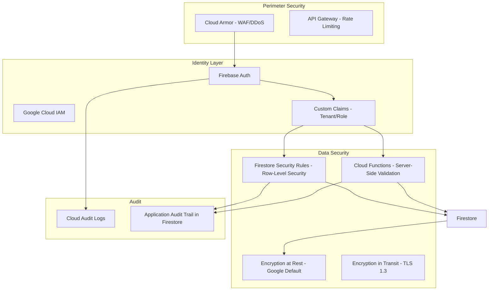

**Defense in Depth — Two-Layer Validation:**
- **Firestore Security Rules:** Enforce tenant isolation at the database level (prevents unauthorized reads/writes)
- **Cloud Functions Server-Side Validation:** Enforce business logic that is too complex for rules alone (cap calculations, cross-document consistency, financial validations)

This dual approach is critical for an ERP-class system handling financial data. Security Rules catch unauthorized access; Cloud Functions validate business correctness.

**Firestore Security Rules** enforce multi-tenant isolation:
- Institution users can ONLY read/write their own `/institutions/{theirId}/` subtree
- Collective users can ONLY access their own `/collectives/{theirId}/` subtree
- Athletes can ONLY access their own `/athletes/{theirId}/` subtree
- Cross-tenant reads are governed by explicit consent documents in `/athletes/{id}/consent/`
- All write operations are logged to the audit trail

### 8.5 Integration Architecture — Progressive Model

> **Critical Design Decision:** CAPS and NIL Go are brand-new systems built by enterprise vendors (LBi, Deloitte). Their API availability is uncertain. REV|NIL's integration architecture is built around a **progressive enhancement model** — start simple, upgrade as the external systems mature.

| Integration Tier | Method | When |
|:-----------------|:-------|:-----|
| **Tier 1 - Manual** | Copy/paste data, manual entry into REV|NIL | Day 1 - always available |
| **Tier 2 - File Import** | CSV/Excel upload with smart parsing and validation | Phase 1 - primary integration method |
| **Tier 3 - Scheduled Sync** | Automated file pickup from shared Cloud Storage bucket or SFTP | Phase 2 - when partners agree |
| **Tier 4 - Real-Time API** | REST/GraphQL API integration with webhooks | Phase 3+ - when CAPS/NIL Go publish APIs |

**This is not a limitation — it is a strength.** By designing for CSV import first, we:
1. Deliver value immediately without waiting on third-party API timelines
2. Work with ANY data format the partner systems export
3. Build robust data validation and error handling
4. Create an upgrade path that adds speed without changing the user experience

| External System | Phase 1 Method | Future Method | Data Flow |
|:----------------|:---------------|:--------------|:----------|
| **CAPS - LBi** | CSV import via Cloud Storage + Cloud Functions parser | REST API when available | Read: cap data, allocations; Write: proposed allocations |
| **NIL Go - Deloitte** | CSV import via Cloud Storage + Cloud Functions parser | REST API when available | Read: deal statuses; Write: deal submissions |
| **University Payroll** | CSV import from Workday/Oracle export | API integration | Read: W-2 data for athlete income dashboard |
| **Social Media** | Instagram Graph API, TikTok API, X API | Same | Read: follower counts, engagement, post verification |
| **Sports Data** | ESPN API, PFF API | Same | Read: performance stats for valuation engine |

---

## 9. AI Strategy: Hybrid Approach

### 9.1 AI Prioritization Matrix

The hybrid approach means we build core workflows FIRST, then layer AI where it delivers the highest impact. AI features are ranked by impact vs. complexity:

| AI Feature | Impact | Complexity | Phase | Google Service |
|:-----------|:-------|:-----------|:------|:---------------|
| **Contract Parsing / Data Extraction** | High | Low | Phase 1 | Document AI + Gemini |
| **VBP Pre-Check** | Critical | Medium | Phase 2 | Gemini API |
| **Hybrid Tax Calculator** | High | Low | Phase 3 | Cloud Functions - rules-based, not ML |
| **CSV Smart Import Parser** | High | Low | Phase 1 | Gemini API - flexible format handling |
| **Deal FMV Benchmarking** | High | Medium | Phase 3 | Vertex AI AutoML |
| **Title IX Scenario Modeling** | Critical | Medium | Phase 1 | Cloud Functions - rules-based |
| **Roster Valuation Engine** | High | High | Phase 3 | Vertex AI Custom Training |
| **Transfer Portal Prediction** | Medium | High | Phase 4 | Vertex AI Custom Training |
| **Multi-Agent Contract Analysis** | Medium | High | Phase 4 | Gemini + Vertex AI Agents |
| **Natural Language Queries** | Medium | Medium | Phase 4 | Gemini API |

### 9.2 AI Architecture

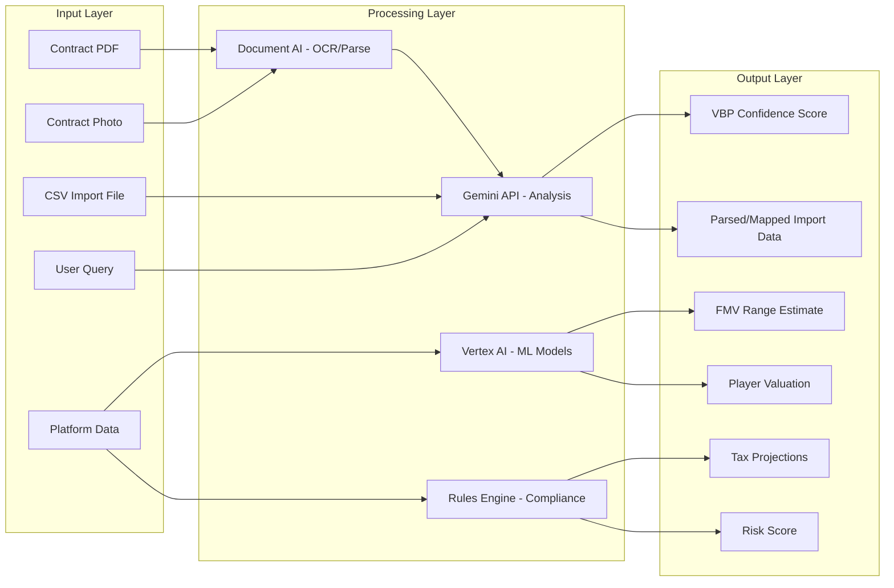

### 9.3 Gemini Integration for Contract Intelligence

The highest-ROI AI feature is **contract analysis using Gemini**:

**Prompt Engineering Approach:**
1. System prompt establishes Gemini as a "CSC compliance analyst"
2. Contract text is extracted via Document AI
3. Gemini analyzes against VBP criteria, flags issues, suggests improvements
4. Structured JSON output feeds the UI

**Example Gemini Workflow:**
```
Input: Extracted contract text
System Context: CSC VBP requirements, ROC benchmarks, rejection patterns

Output - structured:
  vbpScore: 0.72
  riskLevel: medium
  issues:
    - clause: Ambassador role
      risk: Lacks specific deliverables - passive activation risk
      suggestion: Add 4 Instagram posts per month featuring product
  fmvAssessment:
    proposedValue: 25000
    estimatedFMV: 18000-28000
    withinRange: true
```

### 9.4 Gemini for Smart CSV Import

One of the most practical early AI features — using Gemini to handle the chaos of CSV imports from various systems:

- CAPS and NIL Go may export data in different formats over time
- Different universities may have different payroll export formats
- Gemini can map arbitrary CSV column headers to the REVNIL data model
- Human reviews the mapping before import commits
- This eliminates the brittleness of hardcoded CSV parsers

---

## 10. Development Methodology: AI-Assisted Vibe Coding

### 10.1 Development Model

Given the founding team structure (solo technical founder + domain expert + AI coding assistants), the development methodology is optimized for maximum output with quality guardrails.

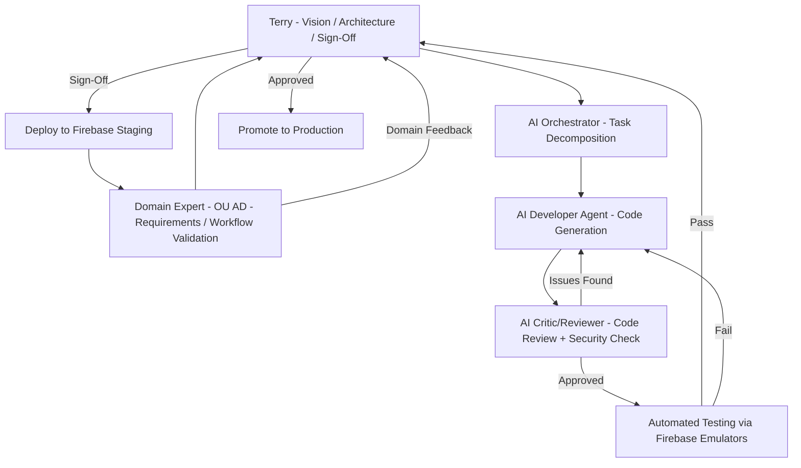

### 10.2 AI Development Roles

| Role | Tool/Agent | Responsibility |
|:-----|:-----------|:---------------|
| **Orchestrator** | Roo Orchestrator Mode | Breaks features into implementable tasks; manages dependencies; coordinates |
| **Developer** | Roo Code Mode | Writes code, creates components, implements business logic, builds integrations |
| **Reviewer/Critic** | Roo Code Mode with review prompt | Reviews code for security, correctness, best practices; catches edge cases |
| **Debugger** | Roo Debug Mode | Investigates issues, traces problems, fixes bugs |
| **Architect** | Roo Architect Mode | Designs components, plans technical approaches, ensures consistency |
|:-----|:-----------|:---------------|
| **Orchestrator** | Roo Orchestrator Mode | Breaks features into implementable tasks; manages dependencies; coordinates |
| **Developer** | Roo Code Mode | Writes code, creates components, implements business logic, builds integrations |
| **Reviewer/Critic** | Roo Code Mode with review prompt | Reviews code for security, correctness, best practices; catches edge cases |
| **Debugger** | Roo Debug Mode | Investigates issues, traces problems, fixes bugs |
| **Architect** | Roo Architect Mode | Designs components, plans technical approaches, ensures consistency |

### 10.3 Quality Assurance Strategy

Since AI writes the code, quality gates are critical:

1. **AI Code Review:** Every piece of generated code goes through a critic/review pass before merge
2. **Firestore Security Rules Testing:** Automated tests that verify tenant isolation using the Firebase Emulator
3. **Firebase Emulator Suite:** Local testing of Cloud Functions, Firestore rules, Auth — this is the primary testing environment
4. **Integration Tests:** Automated tests against Firebase emulators for critical financial workflows (cap calculations, tax calculations must be exact)
5. **Domain Expert UAT:** Wife validates workflows against real OU Athletic Department processes
6. **Staged Deployments:** Dev (local emulator) > Staging (Firebase project) > Production (Firebase project)

### 10.4 Development Environment

| Tool | Purpose |
|:-----|:--------|
| **VS Code + Roo** | Primary IDE with AI-assisted development |
| **Firebase CLI** | Local emulation, deployment, management |
| **Firebase Emulator Suite** | Local Firestore, Functions, Auth, Hosting emulation |
| **GitHub** | Source control, CI/CD via GitHub Actions |
| **Google Cloud Console** | GCP resource management, monitoring |

### 10.5 Why This Model Works for a Solo Founder

The AI-assisted development model is not a compromise — it is a **strategic advantage**:

1. **Speed:** AI generates code 10-50x faster than manual typing. The bottleneck moves from "writing code" to "reviewing code and directing architecture"
2. **Consistency:** AI follows patterns consistently once established. The codebase stays cohesive
3. **Coverage:** The critic/reviewer role catches issues a solo developer might miss from familiarity blindness
4. **Documentation:** AI naturally produces well-documented code and can generate docs as part of the workflow
5. **Scalability:** When the team grows, the codebase is clean, documented, and follows established patterns — making onboarding fast

**The key risk** is quality drift if the human-in-the-loop review becomes rubber-stamping. **Mitigation:** Automated tests are the true gatekeeper. Financial calculations MUST have unit tests. Security rules MUST have isolation tests. These run regardless of human attention.

---

## 11. Phased Implementation Roadmap

### Phase 0: Foundation

**Objective:** Establish the technical foundation and project infrastructure. This phase produces no user-facing features but is critical for everything that follows.

- [ ] Create Google Cloud Project and Firebase project (dev + staging environments)
- [ ] Configure Firebase Authentication with custom claims for multi-tenant roles
- [ ] Design and implement Firestore data model with security rules
- [ ] Write security rules tests using Firebase Emulator
- [ ] Set up CI/CD pipeline with GitHub Actions and Firebase deploy
- [ ] Create the Next.js PWA scaffold on Firebase Hosting
- [ ] Implement base UI component library (use a mature component library like shadcn/ui or Material UI)
- [ ] Set up Firebase Emulator Suite for local development
- [ ] Configure Cloud Logging and Monitoring
- [ ] Create Roo custom modes/prompts for orchestrator/developer/reviewer workflow
- [ ] Establish coding standards document and AI prompt templates

### Phase 0.5: Interactive Prototype

**Objective:** Build a clickable prototype with real data from OU to validate the product concept BEFORE building the full system. This is the most important phase for a bootstrapped startup.

- [ ] Interview wife (OU Associate AD) to document exact current workflows for cap management, NIL tracking, Title IX reporting
- [ ] Obtain sample (anonymized) data: roster, revenue share allocations, NIL deal examples
- [ ] Build the Total Compensation Dashboard with hardcoded/imported sample data
- [ ] Build a basic Cap Utilization view
- [ ] Build a basic Title IX proportionality view
- [ ] Demo to wife and collect detailed feedback
- [ ] Demo to 2-3 other AD contacts (if available through wife's network) for additional validation
- [ ] Document all feedback and prioritize changes
- [ ] Decision gate: validate that the product concept resonates before investing in full build

> **Why Phase 0.5 exists:** The biggest risk for any startup is building something nobody wants. Your wife's position at OU gives you a shortcut that most founders would kill for — direct access to your ideal customer for rapid validation. Use it before writing a line of production code.

### Phase 1: REVNIL GM — Core MVP

**Objective:** Build the Athletic Department beachhead product with the minimum feature set to deliver immediate value.

**Beachhead Customer:** University of Oklahoma Athletic Department

**MVP Scope — Ruthlessly Minimal:**

The MVP must answer ONE question better than anything else: **"What is the total compensation picture of every athlete on my roster, and am I in compliance?"**

- [ ] Build institution onboarding and configuration workflow
- [ ] Implement CSV import pipeline for CAPS data (Cloud Storage + Cloud Functions + Gemini for column mapping)
- [ ] Implement CSV import pipeline for NIL Go data (same architecture)
- [ ] Build the Total Compensation Command Center dashboard (THE hero feature)
- [ ] Implement roster management with sport/gender categorization
- [ ] Build Cap Management module: allocation tracking, remaining cap display, hard-stop alerts
- [ ] Implement Title IX proportionality tracker with alert thresholds
- [ ] Build basic Risk Dashboard: manual NIL deal entry, risk flagging by payor type
- [ ] Implement RBAC: AD, GM, Compliance Officer, Finance roles
- [ ] Build basic CSV export / PDF reporting
- [ ] Integrate Document AI + Gemini for contract text parsing (internal use for deal entry)
- [ ] Domain expert validation cycle: weekly reviews with OU AD workflows
- [ ] Bug fixing and stabilization

**Phase 1 Does NOT Include:**
- Scenario simulator (Phase 2)
- AI roster valuation (Phase 3)
- Mobile app (PWA serves mobile needs initially)
- Collective or Athlete products (Phases 2 and 3)
- Real-time API integrations (CSV is fine for MVP)

### Phase 2: REVNIL Collective MVP + GM Enhancements

**Objective:** Launch the Collective product and enhance GM with strategic planning tools.

- [ ] Build collective onboarding and configuration workflow
- [ ] Implement Deal Pipeline Manager with full lifecycle tracking
- [ ] Build VBP compliance checklist and contract template library
- [ ] Implement Proof of Activation tracking (manual entry + photo upload)
- [ ] Build Financial Operations module: payment tracking, 1099 prep
- [ ] Implement Gemini-powered VBP Pre-Check for deal contracts
- [ ] Build basic Donor CRM with business classification
- [ ] Create REVNIL Connect: secure messaging between AD compliance and Collective
- [ ] **GM Enhancement:** Cap Simulator with what-if scenario builder
- [ ] **GM Enhancement:** Deal FMV benchmarking using platform data
- [ ] **GM Enhancement:** Improved data import with scheduled sync option
- [ ] Begin social media API integrations for follower/engagement data
- [ ] Geo-fenced check-in for Proof of Activation (mobile PWA feature)

### Phase 3: REVNIL Athlete MVP + Intelligence Layer

**Objective:** Launch the Athlete/Agent product and layer on advanced AI capabilities.

- [ ] Build athlete onboarding with consent management
- [ ] Implement Total Income Dashboard (W-2 + 1099 unified view)
- [ ] Build Hybrid Tax Engine with quarterly estimate calculations
- [ ] Implement Deal Management with deliverable calendar
- [ ] Build AI Deal Assistant: contract upload, parsing, VBP pre-check
- [ ] Implement Agent portfolio dashboard for multi-athlete management
- [ ] Implement Proof of Activation mobile features (geo-fence check-in, social post verification)
- [ ] **GM Enhancement:** Roster Valuation Engine with AI (Vertex AI custom model)
- [ ] **GM Enhancement:** Transfer Portal predictive model (retention risk scoring)
- [ ] **Collective Enhancement:** Donor-to-Brand AI matching
- [ ] Full REVNIL Connect rollout: athlete-collective-institution messaging
- [ ] Evaluate: do we need a native mobile app, or is PWA sufficient? (data-driven decision)

### Phase 4: Platform Maturity & Scale

**Objective:** Full ecosystem integration, advanced AI, enterprise hardening, and scale.

- [ ] Implement real-time API integrations with CAPS and NIL Go (if/when APIs become available)
- [ ] Migrate complex analytics to BigQuery for advanced reporting
- [ ] Build Multi-Agent contract analysis system (Gemini + Vertex AI)
- [ ] Implement natural language query interface
- [ ] Build advanced benchmarking dashboards (anonymized cross-platform data)
- [ ] Implement university payroll system integrations (Workday/Oracle APIs)
- [ ] Build parent/family view for athlete financial visibility
- [ ] Implement automated CSC audit report generation
- [ ] Enterprise features: SSO (SAML/OIDC), advanced RBAC, API access for institutions
- [ ] Build public API for third-party integrations
- [ ] Performance optimization and scale testing
- [ ] SOC 2 Type II compliance preparation
- [ ] Native mobile app (if validated by Phase 3 evaluation)
- [ ] Prepare for CBA/unionization scenario: model union dues, pension, standard contracts

### Implementation Visualization

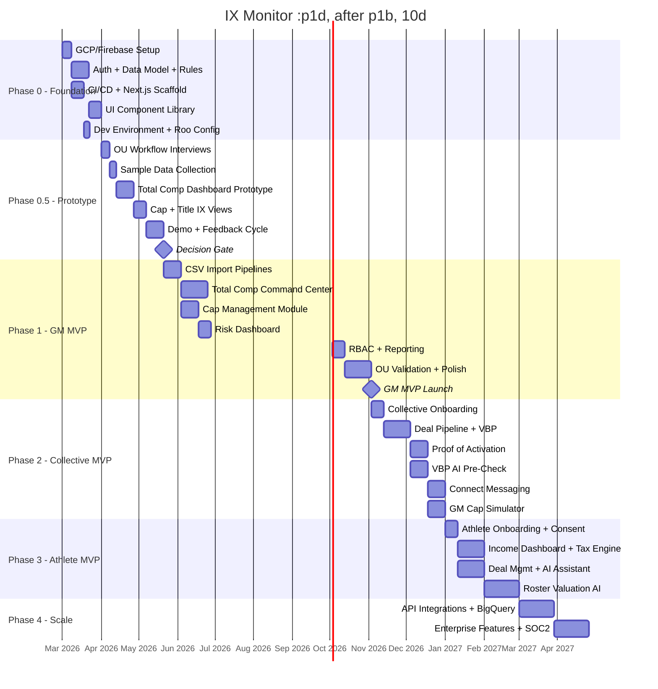

---

## 12. Revenue Model & Investment Readiness

### 12.1 Go-to-Market Strategy: Land with Free, Expand with Value

> **Critical for a bootstrapped solo founder:** Do NOT try to sell $8K/month software on day one. Your beachhead strategy should be: **free pilot → prove value → convert to paid → use as reference → sell to next school.**

| Stage | Strategy | Goal |
|:------|:---------|:-----|
| **Stage 1: Free Pilot** | Offer REVNIL GM free to OU and 2-3 other programs | Validate product, build reference customers, collect feedback |
| **Stage 2: Paid Conversion** | Convert pilots to paid subscriptions once value is proven | Generate initial revenue, prove willingness-to-pay |
| **Stage 3: Conference Deals** | Use reference customers to sell into their conference peers | Scale within a trust network (Big 12, SEC contacts) |
| **Stage 4: National Expansion** | Marketing, conference sponsorships, PR from reference wins | Broad market capture |

### 12.2 Pricing Strategy

| Product | Tier | Price | Target |
|:--------|:-----|:------|:-------|
| **REVNIL GM** | Pilot | Free (3-6 months) | First 3-5 programs |
| **REVNIL GM** | Starter | $2,000/month | Mid-major programs |
| **REVNIL GM** | Pro | $5,000/month | Power 4 programs |
| **REVNIL GM** | Enterprise | $10,000+/month | Elite programs, custom integrations |
| **REVNIL Collective** | Starter | $500/month | Small collectives, < 20 athletes |
| **REVNIL Collective** | Pro | $1,500/month | Major collectives, 20-100 athletes |
| **REVNIL Collective** | Enterprise | $3,500/month | Multi-sport mega-collectives |
| **REVNIL Athlete** | Free | $0 | Basic income tracking, deal list |
| **REVNIL Athlete** | Pro | $19/month | Tax engine, AI deal assistant, full features |
| **REVNIL Athlete** | Agent | $79/month per seat | Multi-athlete portfolio management |

### 12.3 Revenue Projections (Conservative)

| Milestone | Institutions | Collectives | Athletes/Agents | Monthly ARR |
|:----------|:-------------|:------------|:----------------|:------------|
| End of Year 1 | 3-5 (pilots) | 5-10 | 50-100 | $5K-$15K |
| End of Year 2 | 15-30 | 30-60 | 1,000-3,000 | $100K-$250K |
| End of Year 3 | 50-100 | 100-200 | 5,000-15,000 | $400K-$1M |

### 12.4 Investment Thesis

**For Seed/Pre-Seed Investors:**

1. **Massive TAM:** $31M-$130M ARR in a market that did not exist 18 months ago
2. **Regulatory Tailwind:** The *House* settlement MANDATES the complexity we solve — this is not discretionary spend
3. **Network Effect Moat:** Each stakeholder type increases value for the others; switching costs compound
4. **Domain Expert Moat:** Co-founder is an Associate AD at a Power 4 institution — unmatched market access and product validation
5. **Capital Efficient:** AI-assisted development enables enterprise-grade output from a lean team; proven by shipping MVP with minimal burn
6. **Platform Play:** Starts as management tool, becomes the data infrastructure layer of collegiate athletics
7. **Future-Proof:** Architecture designed for inevitable CBA/unionization transition (expands the platform value)
8. **PE Demand:** Private equity entering college athletics needs exactly this kind of reporting infrastructure

### 12.5 When to Raise (Decision Framework)

| Signal | Action |
|:-------|:-------|
| Phase 0.5 validates: OU loves the prototype | Begin building pitch deck |
| Phase 1 MVP live with 3+ pilot institutions | Actively seek pre-seed ($250K-$500K) |
| 10+ paying institutions, proven conversion from pilot | Seek seed round ($1M-$3M) |
| 30+ institutions, collective and athlete products live | Seek Series A ($5M-$15M) |

### 12.6 Use of Funds (Seed Round Target: $1M-$3M)

| Category | Allocation | Purpose |
|:---------|:-----------|:--------|
| Engineering | 40% | Hire 2-3 senior engineers to accelerate development |
| Sales & BD | 25% | Hire AD-facing sales team; conference sponsorships |
| Operations | 15% | Legal, compliance consulting, infrastructure costs |
| Marketing | 10% | Brand building, conference presence, content marketing |
| Reserve | 10% | Runway extension, contingency |

---

## 13. Risk Analysis

| Risk | Likelihood | Impact | Mitigation |
|:-----|:-----------|:-------|:-----------|
| CAPS/NIL Go do not offer API access | Medium | Medium (not High) | Designed CSV-first; API is additive, not required. Build relationship with LBi/Deloitte early |
| Regulatory framework changes significantly | Medium | Medium | Configurable rules engine; modular architecture allows rapid adaptation |
| Competitor with more funding enters market | High | Medium | Speed to market + domain expertise moat + network effect lock-in |
| Title IX legal landscape shifts | Medium | Low | Monitor and adapt; Title IX module is configurable, not hardcoded |
| AI-generated code quality issues | Medium | Medium | Strict review process; Firebase Emulator testing; automated tests for financial logic |
| Collective Bargaining replaces settlement | Medium | Low | Architecture already designed for CBA support; this EXPANDS our value |
| Data privacy incident | Low | Critical | Firestore Security Rules; Cloud Armor; encryption; regular security audits; server-side validation |
| Slow enterprise sales cycle | High | Medium | Use OU as reference customer; free pilot programs; conference-level deals |
| Google Cloud pricing at scale | Low | Low | Firebase free tier covers early stage; Blaze plan scales predictably; BigQuery only added when needed |
| Firestore limitations for complex queries | Medium | Medium | Design data model carefully with denormalization; add BigQuery in Phase 4 for analytics; Firestore aggregation queries for real-time |
| Solo founder burnout | Medium | High | AI-assisted development reduces manual work; domain expert handles product validation; phase the work to maintain momentum |
| OU connection creates perception of bias | Low | Medium | Seek diverse pilot customers early; transparent governance; data isolation between institutions |

---

## 14. Competitive Landscape

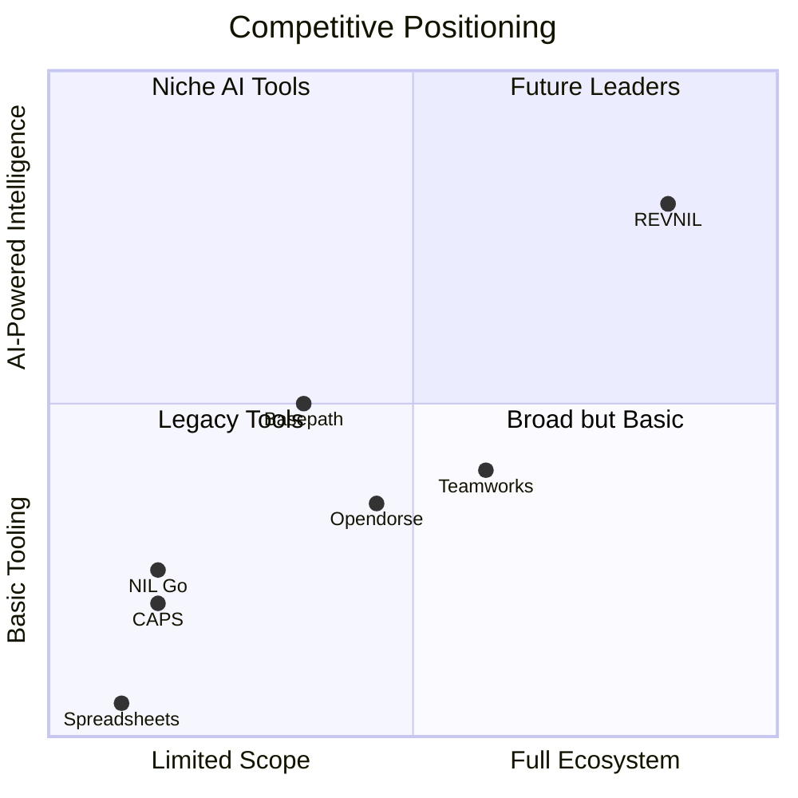

**Why REVNIL Wins:**
- Only platform bridging both compensation buckets
- Only platform serving all three stakeholder groups in one ecosystem
- AI-powered intelligence vs. competitors basic tooling
- Domain expert co-founder provides unmatched product-market fit
- Google Cloud infrastructure provides enterprise credibility and scalability
- Network effects create a moat that strengthens with each customer

---

## 15. Critical Architectural Decisions & Tradeoffs

This section documents the key decisions optimized for YOUR specific situation: solo technical founder, AI-assisted development, domain expert co-founder at OU, Google ecosystem, bootstrapped to start.

### 15.1 Why Next.js PWA Instead of Native Mobile Apps

| Factor | PWA | Native (Flutter/React Native) |
|:-------|:----|:------------------------------|
| **Development effort** | 1 codebase serves web + mobile | 2 codebases (or 1 cross-platform + web) |
| **Solo founder feasibility** | High — one framework to learn/maintain | Low — adds significant complexity |
| **App store approval** | Not needed; instant deployment | Requires Apple/Google review cycles |
| **Offline support** | Yes (service workers) | Yes (native) |
| **Push notifications** | Yes (FCM via web push) | Yes (native) |
| **Install on phone** | Yes (Add to Home Screen) | Yes (app store) |
| **Enterprise credibility** | Moderate (improving) | High |

**Decision: Start with PWA. Evaluate native mobile in Phase 3** based on actual user feedback. If athletes specifically request a native app, build it then — with revenue to fund it.

### 15.2 Why Firestore Over Cloud SQL/PostgreSQL

| Factor | Cloud Firestore | Cloud SQL (PostgreSQL) |
|:-------|:----------------|:-----------------------|
| **Real-time sync** | Built-in — dashboards update live | Requires additional infrastructure (WebSockets) |
| **Offline support** | Built-in — critical for mobile users | Requires additional infrastructure |
| **Multi-tenancy** | Security Rules enforce row-level isolation | Requires application-level or RLS implementation |
| **Scaling** | Automatic — no capacity planning | Manual scaling decisions |
| **Complex queries** | Limited — no JOINs, limited aggregation | Full SQL power |
| **Financial reporting** | Adequate for Phase 1-3 with denormalization | Better for complex cross-entity analytics |
| **Solo developer speed** | Very fast — Firebase SDK handles most plumbing | Slower — need ORM, connection pooling, migrations |
| **Cost at low scale** | Free tier generous | Minimum ~$7/month for always-on instance |

**Decision: Firestore for Phase 1-3. Add BigQuery in Phase 4** for complex analytics, benchmarking, and investor reporting. Firestore handles the operational workload; BigQuery handles the analytical workload. This is a proven Google pattern.

**Firestore Limitation Mitigations:**
- **No JOINs:** Use denormalization (store athlete name in deal document, not just athleteId). Accept some data duplication for read performance
- **Limited aggregation:** Use Firestore Aggregation Queries (count, sum, average) for real-time metrics; use Cloud Functions to maintain pre-computed aggregates in summary documents
- **Complex queries:** For anything beyond Firestore's capability, stream data to BigQuery via Firestore-to-BigQuery extension (Firebase Extension available)

### 15.3 Why NOT Microservices (Yet)

Many enterprise architectures default to microservices. For a solo founder with AI-assisted development, this is a trap.

| Architecture | Solo Founder Reality |
|:-------------|:--------------------|
| **Microservices** | Each service needs its own deployment, monitoring, versioning. 10 services = 10x operational overhead. Solo founder drowns in DevOps |
| **Modular Monolith** | One deployment, one monitoring target, one CI/CD pipeline. Modules are separated by code organization, not network boundaries. Can be split into microservices later IF scale demands it |

**Decision: Build a modular monolith using Cloud Functions organized by domain.** Each module (GM, Collective, Athlete, Connect) gets its own directory and Cloud Functions group, but they deploy together and share the Firestore database.

```
functions/
├── src/
│   ├── gm/           — GM module Cloud Functions
│   ├── collective/    — Collective module Cloud Functions
│   ├── athlete/       — Athlete module Cloud Functions
│   ├── connect/       — Connect module Cloud Functions
│   ├── ai/            — AI service functions (Gemini, Document AI)
│   ├── integrations/  — CAPS, NIL Go, Social connectors
│   └── shared/        — Shared utilities, types, auth helpers
├── package.json
└── tsconfig.json
```

### 15.4 Why Phase 0.5 (Prototype) Is Non-Negotiable

This is the most important architectural decision in the entire plan. Here is why:

**The Startup Graveyard is Full of Beautiful Architecture:**

Your biggest risk is NOT technical. Your biggest risk is building the wrong thing. Your wife's position at OU is a once-in-a-lifetime validation opportunity. The prototype phase ensures:

1. **You build what ADs actually need**, not what the research document hypothesizes they need
2. **You discover unknown workflows** — there are undoubtedly processes at OU that the research document does not cover
3. **You get real data** — even anonymized/sample data reveals edge cases that no amount of planning can predict
4. **You build credibility** — showing OU a working prototype makes them a champion, not just a contact
5. **You de-risk everything that follows** — every dollar and hour spent after Phase 0.5 is spent on validated features

**What Phase 0.5 is NOT:**
- It is NOT a throwaway. The prototype uses the same tech stack (Next.js, Firestore, Firebase Auth) as the production system
- It is NOT a mockup. It uses real data and real interactions
- It IS the seed of the production system that gets progressively enhanced

### 15.5 Data Model: Denormalization Strategy

Firestore requires intentional denormalization for performance. Here is the strategy:

**Principle: Optimize for the dashboard read, not the write.**

The Total Compensation Command Center is the hero feature. It must load fast. Therefore:

- Each athlete document in `/institutions/{id}/roster/{athleteId}/` contains a pre-computed `totalComp` object that sums all sources
- When a new NIL deal is entered or imported, a Cloud Function recalculates `totalComp` and writes it back
- The dashboard reads ONE collection (`roster`) and has everything it needs — no cross-collection queries
- Title IX aggregates are maintained in a summary document updated by Cloud Functions on every roster change
- Cap utilization is a single document updated by Cloud Functions on every allocation change

**This means writes are slightly slower (trigger recalculation) but reads are instant.** For a dashboard product, this is the correct tradeoff.

### 15.6 Authentication & Authorization Design

Multi-tenant RBAC using Firebase Auth Custom Claims:

```
Custom Claims Structure:
{
  tenantType: "institution" | "collective" | "athlete" | "agent",
  tenantId: "institutionId" | "collectiveId" | "athleteId",
  role: "admin" | "gm" | "compliance" | "finance" | "coach" | "viewer",
  linkedTenants: ["collectiveId1", "athleteId1"]  // for cross-tenant access
}
```

**How it works:**
1. User signs up and is assigned to a tenant by an admin (or self-assigns for athletes)
2. Custom Claims are set via Cloud Function (admin SDK)
3. Firestore Security Rules read Custom Claims to enforce access
4. `linkedTenants` enables the consent-based cross-tenant data sharing

### 15.7 Cost Projection: Google Cloud

| Phase | Monthly GCP Cost Estimate | Notes |
|:------|:--------------------------|:------|
| Phase 0 | $0-$10 | Firebase free tier; Emulator Suite is free locally |
| Phase 0.5 | $0-$25 | Small Firestore reads/writes; minimal Function invocations |
| Phase 1 (MVP, 3-5 institutions) | $50-$150 | Firestore Blaze plan; moderate Function invocations; Document AI per-page pricing |
| Phase 2 (15-30 institutions) | $200-$500 | Increased Firestore; Gemini API calls; Cloud Storage |
| Phase 3 (50+ institutions) | $500-$2,000 | Vertex AI model training; increased scale |
| Phase 4 (100+ institutions) | $2,000-$10,000 | BigQuery; full API integrations; enterprise scale |

These costs are well within bootstrapping range through Phase 2, and should be covered by revenue from Phase 2 onward.

### 15.8 What Could Go Wrong (And How We Adapt)

| Scenario | Adaptation |
|:---------|:-----------|
| OU does not want to be a pilot customer (institutional politics) | Pivot to a mid-major program where the AD has more autonomy; use wife's network for warm intros |
| CAPS and NIL Go lock down data export | Build manual entry workflows; offer "better than spreadsheets" value even without imports |
| Firestore does not handle the financial query complexity | Add BigQuery earlier than Phase 4; use Firestore for operational data, BigQuery for analytics |
| A well-funded competitor (Teamworks, Opendorse) builds this | They are platform companies adding features; we are purpose-built. Our depth in the two-bucket problem will exceed their breadth. Also: they lack an AD co-founder |
| The regulatory landscape changes dramatically (federal legislation) | Modular architecture means we swap out the rules engine, not the platform. We are building management tools, not the regulations themselves |
| AI coding produces subtle financial bugs | Every financial calculation has unit tests with known correct values. Tax calculations, cap calculations, and Title IX ratios are tested to the cent |

---

## Summary: The One-Page Strategy

| Element | Decision |
|:--------|:---------|
| **Product** | REV|NIL — unified platform bridging CAPS and NIL Go for all stakeholders |
| **Beachhead** | Athletic Departments (REV|NIL GM) — highest value, strongest competitive moat |
| **First Customer** | University of Oklahoma via domain expert co-founder |
| **Tech Stack** | Google Cloud: Firebase Auth + Firestore + Cloud Functions + Next.js PWA |
| **AI Strategy** | Hybrid — workflows first, Gemini/Document AI for contract intelligence, Vertex AI for valuation |
| **Dev Model** | Solo founder + AI coding agents (orchestrator/developer/reviewer) + domain expert validation |
| **Architecture** | Modular monolith on serverless; Firestore with denormalization; BigQuery for analytics later |
| **GTM** | Free pilots → paid conversion → conference expansion → national |
| **Critical Path** | Phase 0 (foundation) → Phase 0.5 (OU prototype validation) → Phase 1 (GM MVP) |
| **Moat** | Network effects + domain expertise + two-bucket bridge (unique positioning) |

---

*This plan is a living document. It will be refined as development progresses and market feedback is gathered.*

*Last Updated: February 15, 2026*
